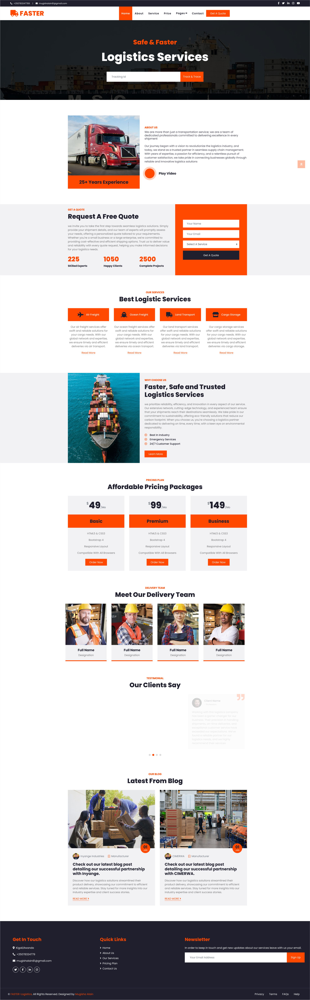

# logistics-website
**FASTER Logistics Website Description:**

Welcome to "FASTER," where efficiency meets reliability in logistics solutions. Our website is designed to streamline your shipping and transportation needs with cutting-edge features that prioritize speed, accuracy, and customer satisfaction.

**Key Features:**

1. **Real-Time Tracking:**
   - Experience transparency in logistics with real-time tracking of your shipments. Monitor the location and status of your packages throughout the entire journey.

2. **Automated Scheduling:**
   - Easily schedule and manage shipments with our intuitive automated scheduling system. Set pickup and delivery times, and let FASTER take care of the rest.

3. **Route Optimization:**
   - Benefit from our advanced route optimization algorithms, ensuring the most efficient and cost-effective delivery routes. Minimize transit times and maximize fuel efficiency.

4. **Customizable Dashboards:**
   - Access personalized dashboards with key performance indicators (KPIs) and analytics to track and analyze your logistics operations. Make data-driven decisions to enhance your supply chain.

5. **Instant Quotes:**
   - Obtain instant and accurate shipping quotes tailored to your specific needs. Our quote generator considers variables such as distance, package dimensions, and delivery urgency.

6. **Secure Warehousing:**
   - Leverage our secure and strategically located warehouses for efficient storage and distribution. Monitor inventory levels, manage stock, and reduce lead times.

7. **Collaborative Platform:**
   - Foster collaboration with our platform that connects shippers, carriers, and receivers. Seamlessly communicate, share documentation, and resolve issues in real time.

8. **Integrated Documentation:**
   - Simplify paperwork with integrated documentation features. Generate and manage shipping labels, invoices, and customs documentation seamlessly.

9. **Customer Support Center:**
   - Our dedicated customer support center is available 24/7 to address inquiries, provide assistance, and ensure a smooth logistics experience for our clients.

10. **Custom Solutions:**
    - Tailor logistics solutions to match your unique business requirements. FASTER offers customizable services to meet the diverse needs of our clients.

11. **Green Logistics Initiatives:**
    - Commitment to sustainability with green logistics initiatives. FASTER incorporates eco-friendly practices to reduce the environmental impact of transportation.

12. **Mobile Accessibility:**
    - Access FASTER logistics services on the go with our mobile-friendly platform. Manage shipments, track deliveries, and stay connected wherever you are.

At FASTER, we redefine logistics by combining speed with precision. Our website reflects our commitment to innovation, reliability, and customer-centric solutions. Experience the future of logistics with FASTER. Your cargo, our commitment.

IMAGES

  =>  Template Name    : FASTER - Logistics Company Website
  
  =>  Template Author  : Mugisha alain

  =>  Author Website   : https://github.com/Alain-16

